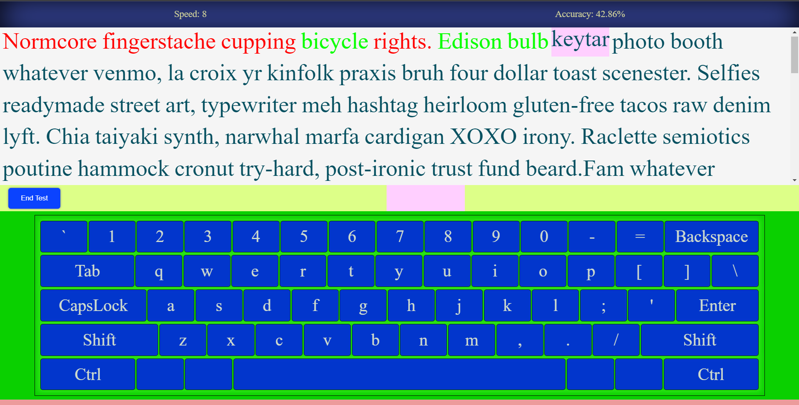
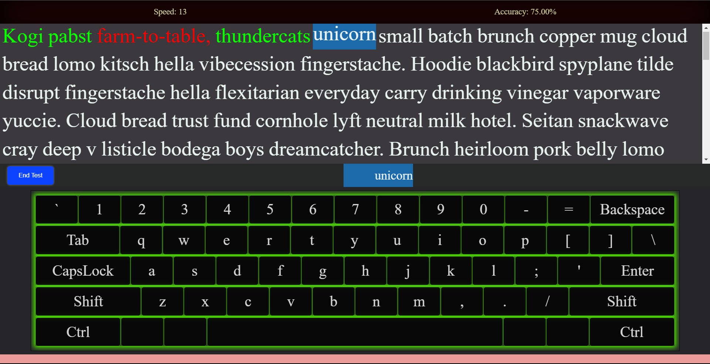
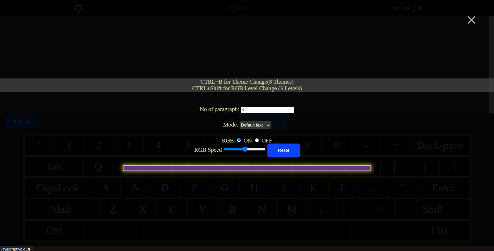

# Typing Test App
___
## Link: https://typing-app-75d30.web.app/
## Features:
- Only use of Basic HTML, CSS and Javascript( without Any library or framework)
- **8 Theme** (change it by Shortcut: **CTRL+B**)
- RGB keyboard with **3 Level** (Change the level by Shortcut: **CTRL+Shift**)
- Text from API, Random and Predefined
- Setting option so that user can change typing setting according to own

## Reference Images:

---
 
---

